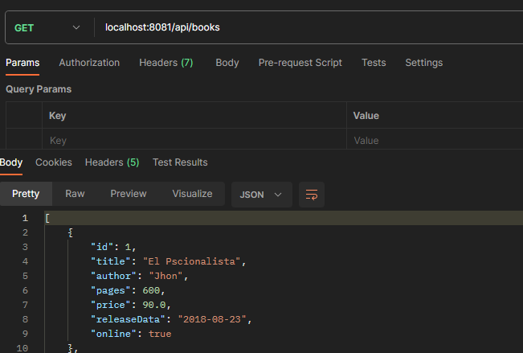
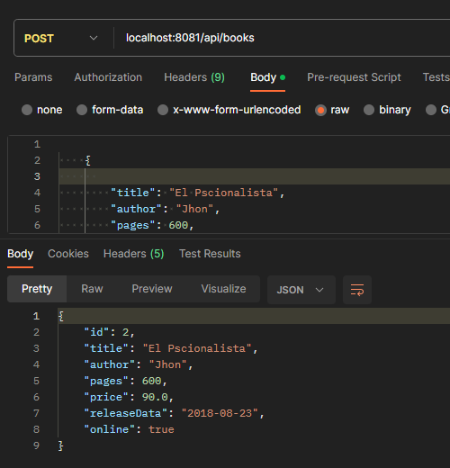
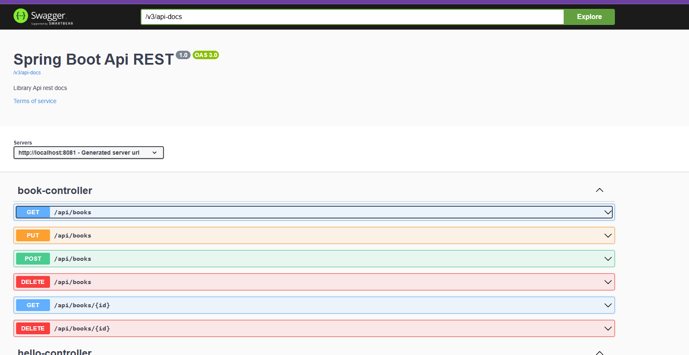
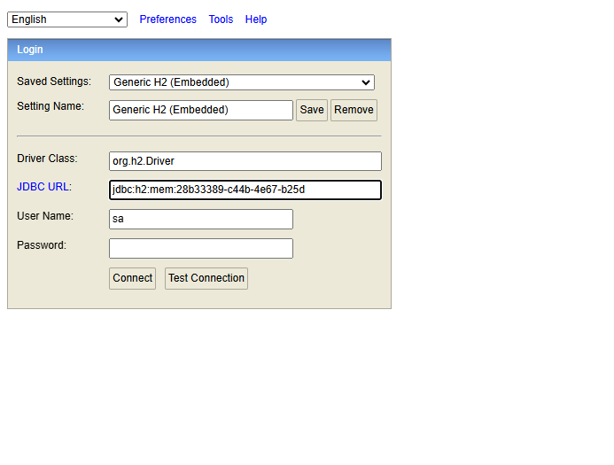

<h1 align="center"><b>🖥️ API REST -  CRUD libros con Spring</b></h1>
<h3>🌼 Proyecto de CRUD - api rest sencialla de libros</h3><br>

<p align="center"></p> 
<p align="center"></p> 
<p align="center"></p>
<p align="center"></p>

## Construido con 🛠️

_Herramientas Utilizadas_

- [Java 17.0.13](https://www.java.com/es/) - Lenguaje Princiapl
- [Spring Boot v3.1.1](https://nodejs.org/es/) - Framework

## Pasos para el uso

**1. Clonar repositorio**

**2. Asegurarse de tener instalado localmente java**

**4. Ingrese algun ditor de codigo como Visual Studio pára ejecutar el programa**

**4.1. Para cambiar el puerto ingrese al archivo de propiedades-dev**

```bash
  server.port=8081
```

**5. Ingrese a la url de la documentación**

```bash
  http://localhost:8081/doc/swagger-ui/index.html
```

**6. Se maneja base de consola H2, para ingresar a ver los registros **

```bash
 http://localhost:8081/h2-console/

 Esto + el id que indica por la consola
```

## Autores ✒️

- **Karen Vargas** - _Trabajo Inicial_ - [KarenVargas](https://github.com/Karen11Vargas)

## Adicionalmente🎁

- Ejercicio practico de Api Rest con Spring 📢
- Ejecuta Localmente 😕
